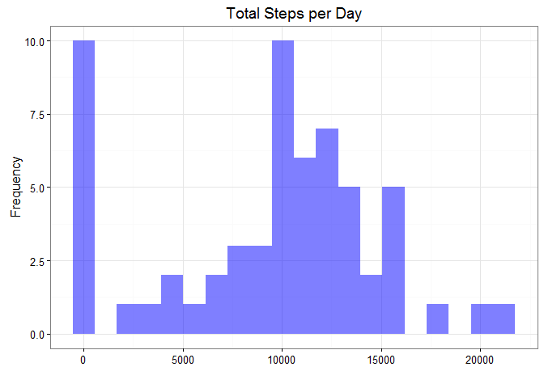
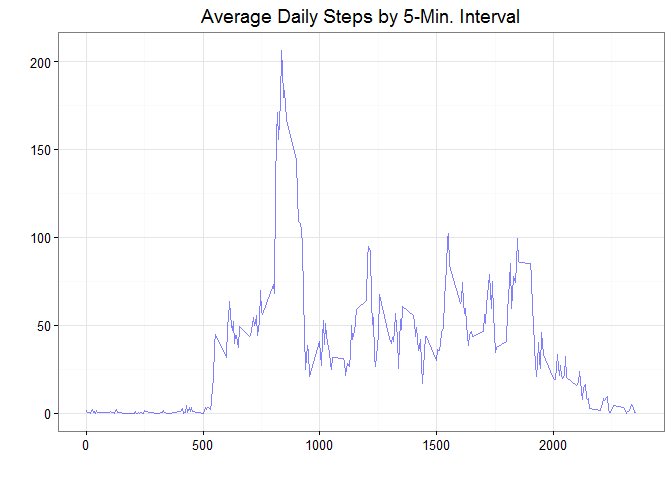
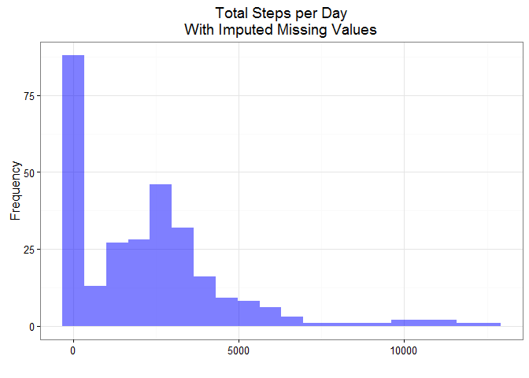
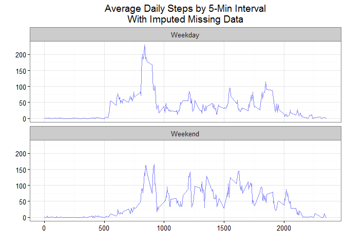

# Reproducible Research: Peer Assessment 1

  
### Loading and preprocessing the data


```r
##setwd(...)

library(lubridate)
library(dplyr)
library(ggplot2)

df <- read.csv("activity.csv", stringsAsFactors = FALSE)
df$date <- ymd(df$date)
df$week_period <- factor(
   ifelse(weekdays(df$date) %in% c("Saturday", "Sunday"), "Weekend", "Weekday"))
```
  
### What is mean total number of steps taken per day?

```r
x <- df %>% 
  group_by(date) %>% 
  summarise(total = sum(steps, na.rm = TRUE))

ggplot(x) + 
  geom_histogram(aes(x = total), fill = "blue", alpha = 0.5, bins = 20) + 
  labs(x = "", y = "Frequency", title = "Total Steps per Day") +
  theme_bw()
```

<!-- -->
  
The mean total steps taken per day is 9,354.  
The corresponding median is 10,395.

  
### What is the average daily activity pattern?

```r
x <- df %>% 
  group_by(interval) %>%
  summarise(avg_steps = mean(steps, na.rm = TRUE))

ggplot(x, aes(x = interval, y = avg_steps)) + 
  geom_line(color = "blue", alpha = 0.5) +
  labs(x = "", y = "", title = "Average Daily Steps by 5-Min. Interval") +
  theme_bw()
```

<!-- -->
  
Interval with maximum average value is 835.
  
### Imputing missing values

```r
## Percent of missing values
n_missing <- prettyNum(sum(is.na(df$steps)), big.mark = ",")
pct_missing <- paste0(round(sum(is.na(df$steps)) / nrow(df) * 100, 2), "%")
```
Number of step observations missing = 2,304.  
Percent of step observations missing = 13.11%.


```r
## Methodolgy:
## 1. Calculate average value by interval
## 2. Replace missing values with average interval value
df_all <- df %>%
  group_by(interval) %>%
  mutate(avg_steps = mean(steps, na.rm = TRUE),
         steps = ifelse(is.na(steps), avg_steps, steps),
         avg_steps = NULL)

## Daily pattern data for plotting
x <- df_all %>%
  group_by(interval) %>%
  summarise(total = sum(steps))

ggplot(x) + 
  geom_histogram(aes(x = total), fill = "blue", alpha = 0.5, bins = 20) + 
  labs(x = "", y = "Frequency", title = "Total Steps per Day\nWith Imputed Missing Values") +
  theme_bw()
```

<!-- -->
  
**With imputed missing values**

The mean total steps taken per day is 2,280.  
The corresponding median is 2,081.
  
Each statistics is much lower than those calculated on the dataset without imputed missing values.


### Are there differences in activity patterns between weekdays and weekends?

```r
x <- df_all %>%
  group_by(week_period, interval) %>%
  summarise(avg_steps = mean(steps))

ggplot(x) +
  geom_line(aes(x = interval, y = avg_steps), color = "blue", alpha = 0.5) +
  facet_wrap(~week_period, nrow = 2) +
  labs(x = "", y = "", title = "Average Daily Steps by 5-Min Interval\nWith Imputed Missing Data") +
  theme_bw()
```

<!-- -->


